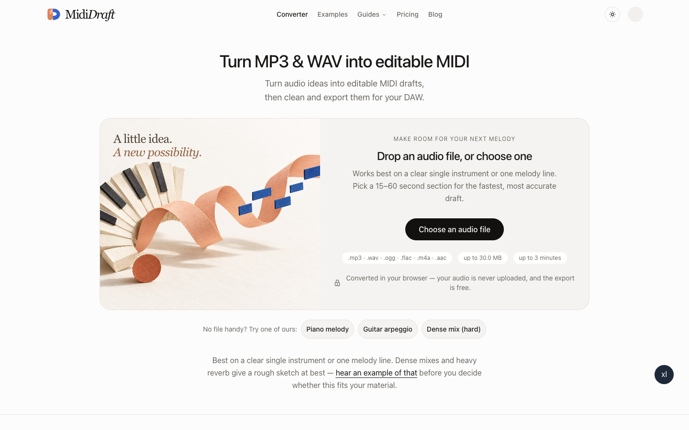

# Illustration and brand refinement

## Preview

http://localhost:3203/ — `pnpm exec vite dev --port 3203`

## Art direction

Warm cut-paper sculpture: ivory piano-key fan, peach sound ribbon and cobalt rectangular note tiles on eggshell paper.

Illustration generated with the built-in image generation tool, then compressed to JPEG (1536 × 1024). Source asset: `public/illustrations/paper-melody.jpg`. Each branch has a different composition and placement. Decorative images use empty alt text. No audio processing code changed.

Brand: Blue and terracotta folded D symbol; serif Midi with italic Draft wordmark.

Vector source: `public/brand/mididraft-mark.svg`. Shared component: `src/components/shared/logo.tsx`. Wordmarks are styled live text using existing system fonts, not a new font file. Desktop header, mobile header and footer use the same lockup. Icons are hand-authored SVG, not raster generated logos.

## Verification

- Production build passed after the illustration and brand changes.
- Biome checks passed for all seven modified source files.
- Full repository check still reports the unchanged formatting error and useConst warning in `scripts/generate-examples.mjs`.
- Desktop 1440 × 900 and mobile 390 × 844 visually inspected; 320px page width checked without horizontal overflow before the brand refinement.
- C's sample entry opens the converter and removes the decorative upload composition as expected.
- A/B introductory illustrations are hidden below 1024px to prioritize file selection; C uses a compact image strip below 640px and hides its decorative caption.
- Artwork uses a deliberately fixed studio background in both themes; typography inherits the active theme.
- Existing preview servers on 3101–3103 showed stale pages. Use the new 3201–3203 previews for these changes.

Style C was selected as the final design. Its illustration, icon and wordmark are retained for integration into master; styles A and B are retired.
